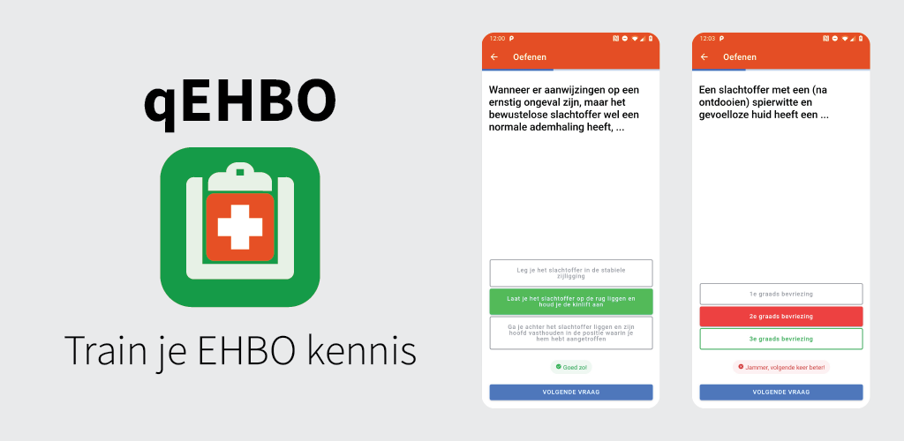

<h1 align="center">
    
     
    qEHBO
</h1>

    Dutch mobile app for training your first aid knowledge, using spaced-repetition learning with quizzes

_Dutch description:_ Oefen je EHBO kennis, op je mobieltje! Ben je aan het leren voor een EHBO examen, of gewoon je kennis aan het opvrissen? Toets en oefen je kennis doelgericht met deze app, in korte sessies. Vragen die jij lastig vindt worden automatisch vaker gesteld, net zo lang totdat je ze beheerst!

## Development
1. Run `yarn` to fetch all dependencies.
2. Run `yarn start` to get a development server running and to preview it in your browser, at [localhost:4200](http://localhost:4200)!
3. Run `ionic cordova run android -l` to run it on a connected Android device (with USB debugging enabled) or in an emulator. This requires the Android SDK to be installed.

## Security
If you discover any security-related issues, please email security@gandreadis.com instead of using the issue tracker.

## Credits
- [Georgios Andreadis](https://github.com/gandreadis) (project lead)
- Konstantinos Andreadis (app icon)
- [All contributors](../../contributors)

## License
The MIT License (MIT). Please see the [license file](LICENSE) for more information.
